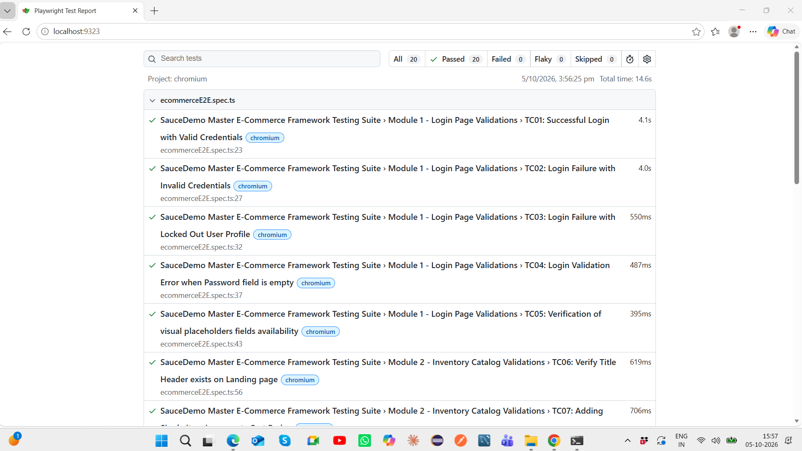
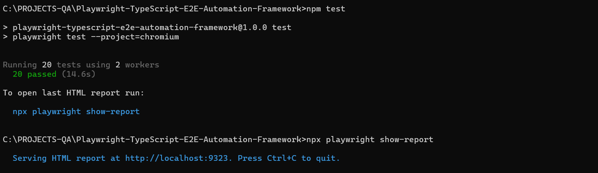

# Playwright TypeScript E2E Automation Framework
[](https://github.com/Pragya-19/Playwright-TypeScript-E2E-Automation-Framework/actions/workflows/playwright.yml)

End-to-end UI automation framework built using **Playwright and TypeScript** with **Page Object Model, external JSON test data, reusable page classes, assertions, HTML reporting, and GitHub Actions CI/CD**.

## Project Objective

This project demonstrates a maintainable end-to-end UI automation framework for validating core e-commerce workflows on SauceDemo.

The framework focuses on:

- Reusable Page Object classes
- Separation of test logic and page interactions
- External test data management
- Functional and negative test coverage
- Stable Chromium execution
- Automated CI execution using GitHub Actions
- Playwright HTML reporting

## Tech Stack

- Playwright
- TypeScript
- Node.js
- Page Object Model
- JSON Test Data
- Git & GitHub
- GitHub Actions
- Playwright HTML Reporter

## Test Coverage

The current suite contains **20 automated test cases** covering:

### Login
- Successful login
- Invalid credentials
- Locked-out user
- Empty field validation
- Login page validation

### Inventory
- Inventory page validation
- Product selection
- Add to cart
- Remove from cart
- Cart badge validation

### Shopping Cart
- Cart navigation
- Product validation
- Remove item from cart
- Continue shopping

### Checkout
- Checkout navigation
- Customer information
- Checkout overview
- Price validation
- Order completion
- Confirmation validation

## Framework Architecture

```text
Test Data
   ↓
Test Cases
   ↓
Page Object Model
   ↓
Playwright Browser Automation
   ↓
Assertions
   ↓
HTML Report
   ↓
GitHub Actions CI

Project Structure
Playwright-TypeScript-E2E-Automation-Framework
│
├── .github/
│   └── workflows/
│       └── playwright.yml
│
├── data/
│   └── testData.json
│
├── pages/
│   ├── LoginPage.ts
│   ├── InventoryPage.ts
│   ├── CartPage.ts
│   └── CheckoutPage.ts
│
├── tests/
│   └── ecommerceE2E.spec.ts
│docs/
└── screenshots/
    ├── playwright-report-20-passed.png
    └── github-actions-ci-passed.png
├── playwright.config.ts
├── package.json
├── package-lock.json
├── .gitignore
└── README.md

Running the Project
Install dependencies:
npm install

Install Playwright browsers:
npx playwright install

Run the stable Chromium test suite:
npm test

Run all configured browser projects:
npm run test:all

Run in headed mode:
npm run test:headed

Open Playwright UI mode:
npm run test:ui

Open the HTML report:
npm run report

CI/CD
GitHub Actions automatically:
1. Checks out the repository
2. Sets up Node.js
3. Installs dependencies
4. Installs Chromium
5. Executes the Playwright test suite
6. Uploads the Playwright HTML report as an artifact
The default CI pipeline currently runs the stable Chromium suite.

Current Execution Status
- 20 Playwright tests
- 20/20 passing locally on Chromium
- GitHub Actions CI passing
- HTML reporting enabled

Key Concepts Demonstrated
- End-to-end UI automation
- Page Object Model
- Reusable locators and page methods
- External test data
- Positive and negative testing
- Playwright assertions
- Automated CI execution
- Test reporting
- Git version control

## Execution Evidence

### Local Playwright Execution

The stable Chromium suite currently executes **20 automated test cases with 20/20 passing**.



### GitHub Actions CI

The automation suite is also executed in a clean Ubuntu CI environment using GitHub Actions.



The CI pipeline installs dependencies and Chromium, executes the Playwright suite, and uploads the HTML report as a workflow artifact.
